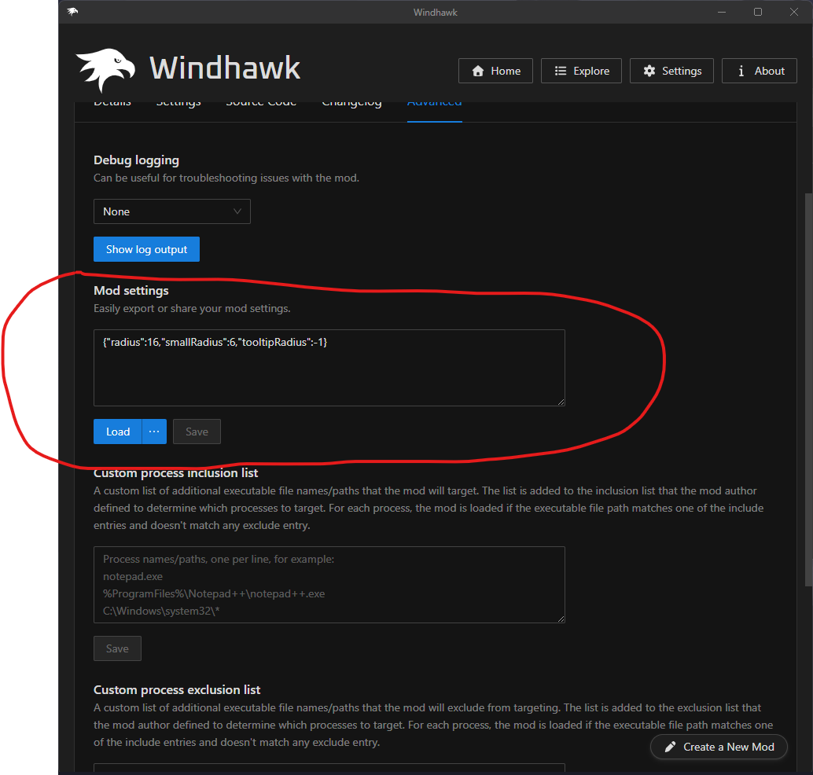
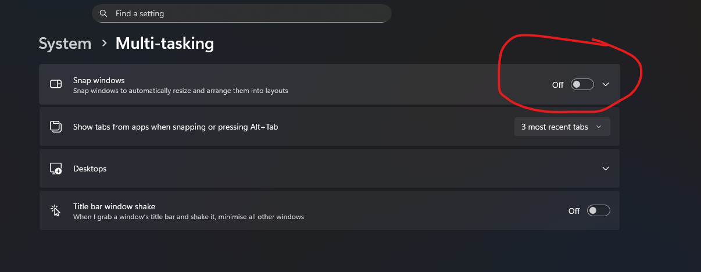
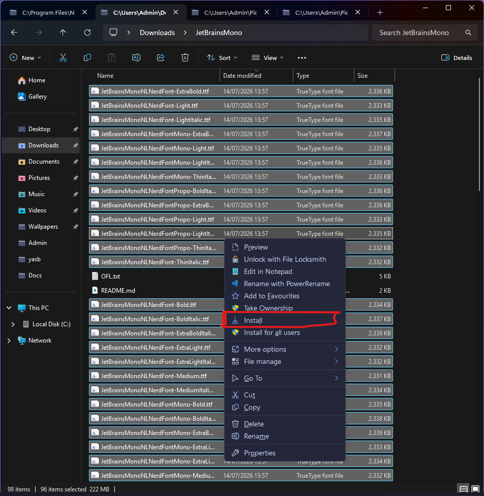

<h1 align="center">Catppuccin untuk Windows 11</h1>

<p align="center">
  
</p>

## 📋 Daftar Isi
- [NileSoft Shell](#nilesoft-shell)
- [Windhawk](#windhawk)
- [Komorebic](#komorebic)
- [Masir](#masir)
- [YASB](#yasb)
- [Cava](#cava)
- [Tacky-Borders (Opsional)](#tacky-borders-opsional)
- [Terminal](#terminal)
- [Aplikasi Tambahan](#aplikasi-tambahan)

---

## NileSoft Shell
Mengganti menu konteks klik kanan Windows dengan tema Catppuccin.

1. Unduh installer NileSoft Shell [di sini](https://nilesoft.org/download/shell/1.9.18/setup-x64.msi)
2. Jalankan file `.msi` dan ikuti proses instalasi hingga selesai
3. Unduh file [theme.nss](nilesoft/theme.nss)
4. Salin file `theme.nss` ke `C:\Program Files\Nilesoft Shell\imports\`
5. Terapkan tema dengan **Ctrl + Klik Kanan** pada desktop atau folder

> **Catatan:** Setelah diterapkan, klik kanan biasa akan langsung menggunakan tema tanpa perlu menekan Ctrl lagi.

---

## Windhawk
Kustomisasi berbagai elemen Windows 11 seperti taskbar, start menu, dan notification center.

1. Unduh Windhawk [di sini](https://ramensoftware.com/downloads/windhawk_setup.exe)
2. Jalankan file `.exe` dan instal hingga selesai
3. Buka aplikasi Windhawk, klik **Explore**, lalu cari dan instal mod berikut:
   - Custom Window Corner Radius
   - Windows 11 Notification Center Styler
   - Windows 11 Start Menu Styler
   - Windows 11 Taskbar Styler
   - Resource Redirect (opsional)
4. Buka folder [windhawk](windwahk) dan salin isi file sesuai dengan nama mod di Windhawk
5. Tempelkan konfigurasi tersebut ke **Mod settings** pada tab **Advanced** di setiap mod
   
   
6. Klik **Save** pada setiap mod agar konfigurasi diterapkan

---

## Komorebic
Window manager tiling untuk Windows.

### Persiapan - Install Scoop (jika belum punya)
Jalankan perintah berikut di **PowerShell sebagai Administrator**:
```powershell
Set-ExecutionPolicy -ExecutionPolicy RemoteSigned -Scope CurrentUser
Invoke-RestMethod -Uri https://scoop.sh | Invoke-Expression
```

### Instalasi Komorebic
```powershell
scoop bucket add extras
scoop install komorebi whkd
```

### Autostart
Agar Komorebic berjalan otomatis saat startup:
```powershell
komorebic enable-autostart --whkd
```

### Konfigurasi
```powershell
komorebic quickstart
komorebic start --whkd
```
File konfigurasi akan dibuat di `C:\Users\<nama_user>\komorebi.json`

Unduh file [komorebic.json](komorebic/komorebi.json) dan timpa file yang sudah ada.

> **⚠️ Penting:** Matikan fitur **Snap Windows** di Windows 11 Settings agar tidak terjadi konflik.
> 
> 

---

## Masir
Mengubah fokus window berdasarkan posisi kursor (follow mouse focus).

1. Unduh installer Masir [di sini](https://github.com/LGUG2Z/masir/releases/download/v0.1.2/masir-0.1.2-x86_64.msi) (versi 0.1.2)
   
   > Cek [halaman rilis](https://github.com/LGUG2Z/masir/releases) untuk versi terbaru

2. Restart Komorebic dengan Masir:
```powershell
komorebic stop --whkd
komorebic start --whkd --masir
komorebic enable-autostart --whkd --masir
```

---

## YASB
Status bar kustom di bagian atas layar.

1. Unduh dan instal **JetBrainsMono Nerd Font**:
   - Unduh dari [sini](https://github.com/ryanoasis/nerd-fonts/releases/latest/download/JetBrainsMono.zip)
   - Ekstrak dan instal semua font
   
   

2. Instal YASB via Scoop:
```powershell
scoop bucket add extras
scoop install extras/yasb
```

3. Unduh 3 file konfigurasi [di sini](YASB)
4. Salin ketiga file tersebut ke `C:\Users\<nama_user>\.config\yasb\` dan timpa file yang ada
5. Jalankan YASB dari Start Menu atau terminal

> **Catatan:** YASB harus dijalankan secara manual setiap kali komputer dinyalakan.

---

## Cava
Visualizer audio berbasis terminal.

1. Unduh file konfigurasi [di sini](cava)
2. Instal Cava melalui salah satu cara berikut:

**Via Winget:**
```powershell
winget install -e --id karlstav.cava
```

**Via Scoop:**
```powershell
scoop install extras/cava
```

3. Letakkan file konfigurasi di `C:\Users\<nama_user>\AppData\Roaming\cava\config`

---

## Tacky-Borders (Opsional)
Border aktif untuk window manager. *Disarankan menggunakan border bawaan Komorebic saja.*

1. Instal [Visual Studio Code](https://visualstudio.microsoft.com/downloads/) dan Rust:
```powershell
curl --proto '=https' --tlsv1.2 -sSf https://sh.rustup.rs | sh
```

2. Clone dan jalankan Tacky-Borders:
```powershell
git clone https://github.com/lukeyou05/tacky-borders.git
cd tacky-borders
cargo build --release
cargo run --release
```

3. Unduh file [config.yaml](tacky-border/config.yaml)
4. Letakkan di folder konfigurasi Tacky-Borders

> **Catatan:** Tacky-Borders harus dijalankan manual setiap startup. Karena itu, lebih disarankan menggunakan border bawaan Komorebic.

---

## Terminal
Konfigurasi Windows Terminal dengan tema Catppuccin.

1. Buka Windows Terminal, buka **Settings** (`Ctrl + ,`)
2. Klik **Open JSON file** di pojok kiri bawah
3. Salin dan tempel isi file [settings.json](terminal/setting.json)
4. Atur PowerShell Profile:
```powershell
notepad $PROFILE
```
5. Masukkan kode berikut ke dalam file:
```powershell
$env:Path += ";$env:ProgramData\starship"
Invoke-Expression (&starship init powershell)

fastfetch
```

---

## Aplikasi Tambahan
Aplikasi berikut diinstal tanpa konfigurasi tambahan:

| Aplikasi | Perintah Instalasi |
|----------|-------------------|
| **Cmatrix** | Unduh [di sini](https://github.com/nxstynate/cmatrix-win/releases/download/cmatrix/cmatrix.exe) |
| **Clock-rs** | `cargo install clock-rs` |
| **Pipes-rs** | `scoop install pipes-rs` |
| **Btop** | `scoop install btop` |
| **Fastfetch** | `scoop install fastfetch` |
| **VS Code** | Unduh [di sini](https://code.visualstudio.com/) |
| **Microsoft PowerToys** | Unduh dari Microsoft Store atau [GitHub](https://github.com/microsoft/PowerToys) |
| **Starship** | `winget install starship` atau `scoop install starship` |

---

## Done

Setelah semua langkah selesai, sistem Windows 11 Anda akan bertransformasi dengan tema Catppuccin yang elegan dan fungsionalitas window manager yang powerful.

> 💡 **Tips:** Jika ada kendala, pastikan semua path sudah sesuai dan aplikasi berjalan di background.

---
